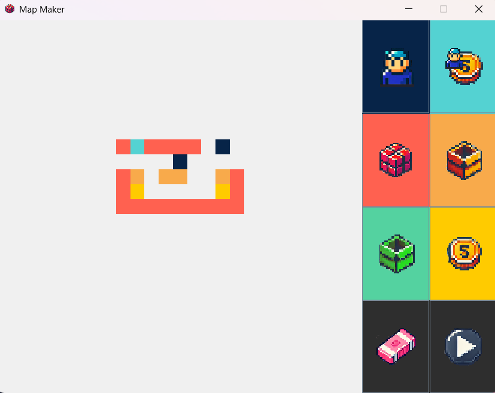

# Sokoban Solver

## Sokoban Description
Sokoban is a classic puzzle video game where the player pushes some objects, trying to get them to designated tiles, often in the context of a worker pushing crates in a warehouse. The game is played on a grid of squares, where each square can be empty, a wall, a box, or a storage location. The challenge lies in the fact that the player can only push boxes (not pull), and only one box can be pushed at a time. The goal is to move all the boxes onto the storage locations with the fewest possible moves. Sokoban is known for its simple mechanics yet complex and challenging puzzles that require careful planning and strategic thinking. Sokoban is an NP-hard and PSPACE-complete problem.

## Project Description
This project was originally an output for my Introduction to Artificial Intelligence class which I enjoyed very much. Our main task was simply to write the algorithm that will solve at least several maps that were only available to us on the day of the presentation. We were given some Driver codes, sample maps, and basic GUI files to start us off. 

I was very proud of this project and I didn't want this to just collect dust in my files so I went ahead and revised most of the code and created a GUI for a map editor; the original starter codes read maps from text files.

## Instructions
If you're just interested in trying out the map editor and solver, go ahead and download `Sokoban Solver.jar`. I didn't really implement any input validation for the map editor so just try to keep the following in mind:

1. Don't add more than 1 player in the map
2. Number of boxes should equal number of goals
3. **Important:** Make sure the player is enclosed in walls \
Do: \
   \
Don't: \
   \
4. If the input is a bit complicated, expect it to process for a while
